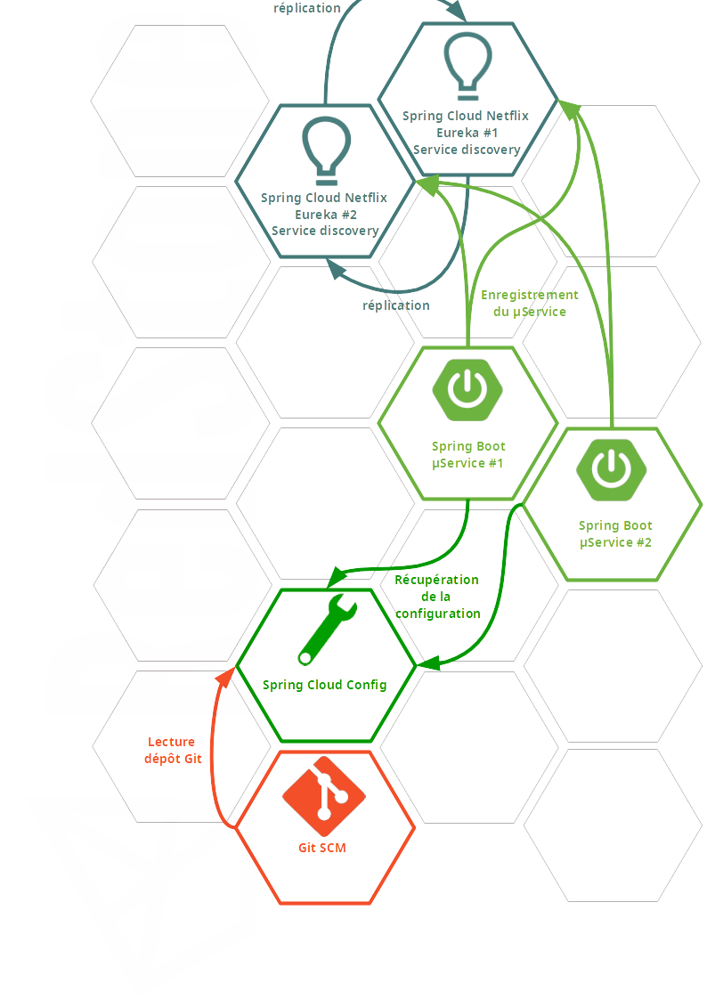
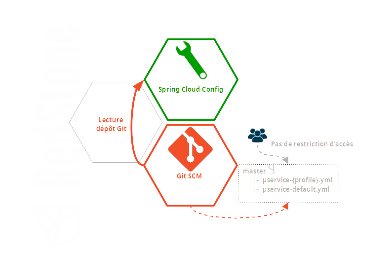
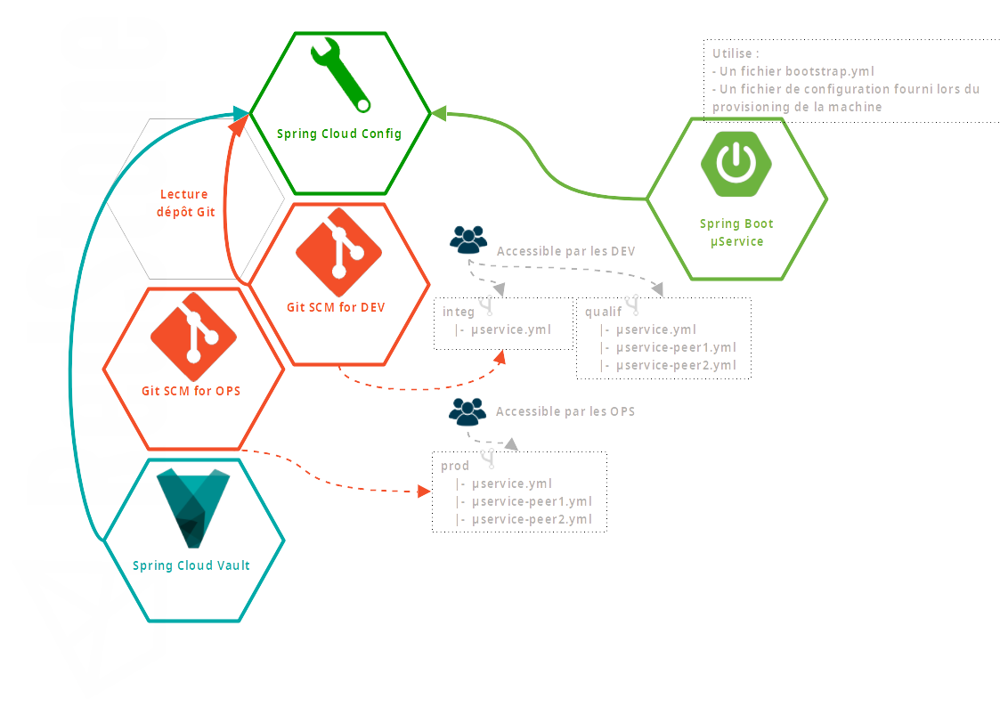

# Spring Cloud Config

- [Spring Cloud Config](#spring-cloud-config)
  - [Fonctionnement](#fonctionnement)
    - [les profils Spring](#les-profils-spring)
    - [Organisation d'un dépôt Git](#organisation-dun-dépôt-git)
  - [Les critères de choix](#les-critères-de-choix)
    - [L'organisation, en terme de séparation de responsabilités](#lorganisation-en-terme-de-séparation-de-responsabilités)
    - [La sécurité](#la-sécurité)
    - [_Exemples_ :](#exemples-)
      - [Solution simple :](#solution-simple-)
      - [Solution complète :](#solution-complète-)
  - [Proposition](#proposition)
    - [branche des propriétés immuables](#branche-des-propriétés-immuables)
      - [impacts](#impacts)
        - [configuration de l'application](#configuration-de-lapplication)
        - [Démarrage de l'application :](#démarrage-de-lapplication-)
    - [Une branche par environnement](#une-branche-par-environnement)
      - [impacts](#impacts-1)
        - [configuration de l'application](#configuration-de-lapplication-1)
        - [Démarrage de l'application :](#démarrage-de-lapplication--1)
    - [La branche _**application**_](#la-branche-application)
      - [impacts](#impacts-2)
        - [configuration de l'application](#configuration-de-lapplication-2)
        - [Démarrage de l'application :](#démarrage-de-lapplication--2)
  - [Annexes](#annexes)
    - [Config First Bootstrap](#config-first-bootstrap)
    - [Discovery First Bootstrap](#discovery-first-bootstrap)

[Spring Cloud Config](https://spring.io/projects/spring-cloud-config) permet d'externaliser la configuration des applications d'un système distribué en s'appuyant sur un emplacement centralisé pour gérer lesdites configurations. l'implémentation par défaut du serveur de configuration utilise un dépôt [Git](https://git-scm.com/) pour stocker les configurations.

## Fonctionnement



Toute application Spring Boot peut s'appuyer sur Spring Cloud Config

- en interrogeant directement le serveur de configuration (_Config First Bootstrap_), ou
- en s'appuyant sur l'annuaire de services (_Discovery First Bootstrap_).

___


L'utilisation de Spring Cloud Config implique :

- le remplacement du fichier de configuration (par défaut) `application.yml` par un fichier nommé `bootstrap.yml`
- la modification de l'[ordre de chargement des propriétés par défaut](https://docs.spring.io/spring-boot/docs/current/reference/html/spring-boot-features.html#boot-features-external-config), l'interrogation du serveur de configuration étant prioritaire dans le nouvel ordre.
___


Le serveur de configuration offre une API REST dont le format d'interrogation est :

```
/{application}/{profile}/{label}
```

Ce modèle est populé par défaut avec :

- `application` = `${spring.application.name}`,
- `profile` = `${spring.profiles.active}` ou `default` si aucun profil n'est précisé, et
-  `label` = `${spring.cloud.config.label}` ou `master` (nom de la branche par défaut dans Git) si non précisé. Il peut prendre la valeur d'un _commit ID_, d'un nom de branche ou d'un tag (au sens Git du terme).

___


Il est recommandé de ne pas préfixer la valeur de la propriété `${spring.application.name}` par `application-` lorsque l'on utilise Spring Cloud Config.
___
La gestion de la configuration d'une application s'articule donc autour d'éléments combinables :

- les **profils** (au sens Spring du terme),
- l'**organisation du dépôt Git**, et
- les **règles de précédence** dans le chargement de la configuration.


### les [profils](https://docs.spring.io/spring-boot/docs/current/reference/html/spring-boot-features.html#boot-features-profiles) Spring


Les profils Spring sont dédiés à la séparation des parties des configurations des applications en fonction de l'_"environnement"_ - au sens large du terme - dans lequel elles s'exécutent.

La lecture des configuration liées aux profiles s'effectue dans l'ordre inverse, i.e. du dernier profil spécifié au premier. L'utilisation de profils multiples introduit donc la possibilité - ou le risque - de surcharger la valeur d'une clef de configuration.


### Organisation d'un dépôt Git

Dans le cas particulier de l'utilisation d'un dépôt Git pour la gestion de la configuration des applications avec Spring Cloud Config, sa structuration n'est pas - forcèment - liée à l'organisation du travail d'une équipe comme sur un projet (cf. pour exemples [Gitflow](https://nvie.com/posts/a-successful-git-branching-model/), [Github flow](https://guides.github.com/introduction/flow/), etc.).


## Les critères de choix

Il y a de nombreuses possibilités pour organiser l'externalisation des configurations parmi lesquelle la mise en place de Spring Cloud Config n'est qu'une possibilité supplémentaire.

Parmi les critères de choix de mise en oeuvre, il est possible de prendre en compte principalement :

### L'organisation, en terme de séparation de responsabilités

Quelle part de configuration relève :

- des DEV ?
- des OPS ?

### La sécurité

- Quel accès à certaines propriétés de configuration en fonction de l'environnement d'exécution, notamment celles qui portent des identifiants de comptes et les mots de passe associés ?

 ___


Pour les propriétés qui doivent être sécurisées, comme les mots de passe par exemple, il est possible de complèter la solution Spring Cloud Config avec [Spring Cloud Vault](https://docs.spring.io/spring-cloud-vault/docs/2.2.5.RELEASE/reference/html/)
___


**Chaque organisation doit identifier ses besoins en fonction des contraintes éventuelles qu'elle se fixe.**

### _Exemples_ :

#### Solution simple :



Dans cet exemple, l'application dispose d'un seul fichier de configuration `bootstrap.yml` qui porte au minimum la configuration pour atteindre le serveur de configuration (Config first bootstrap ou Discovery first bootstrap)

Le dépôt Git est organisé avec une seule branche `master` (branche par défaut) et les configurations sont discriminées sous la forme `{applicationName}-{profile}.yml`.

C'est au démarrage de l'application que le profil est précisé.

L'interrogation du serveur de config est faite sous la forme `/µservice/{profile}`.

Si aucun profil n'est précisé, le serveur de configuration renverra la configuration associée à l'appel `/µservice/default`.

#### Solution complète :



Dans cet exemple, l'application dispose toujours à minima d'un fichier de configuration `bootstrap.yml` permettant d'atteindre le serveur de configuration.

Elle peut également utilisé un fichier externe de configuration (fourni lors du provisioning par exemple). Cette configuration sera prise en compte lors du démarrage de l'application au travers de la propriété `spring.config.additional-location`.

Le serveur de configuration s'adosse sur deux dépôts Git distincts, le premier pour les DEV, le second pour les OPS. C'est le serveur de configuration qui déterminera, en fonction des profils actifs (au sens Spring du terme) le dépôt Git sur lequel la configuration sera lue.

D'un autre point de vue, cela permet de gérer très facilement les droits d'accès à ces dépôts pour la modification des propriétés de configuration.

Les dépôts Git sont organisés avec un modèle de branches correspondant aux différents environnements (aspect technique).

La solution est complétée avec Spring Cloud Config Monitor et Spring Cloud Stream pour mettre à jour "_à chaud_ " les configurations des applications (cf. [Spring Cloud Config - Push notifications and Spring Cloud Bus](https://docs.spring.io/spring-cloud-config/docs/2.2.5.RELEASE/reference/html/#_push_notifications_and_spring_cloud_bus)).


## Proposition

La solution proposée tient compte des choix déjà établis, à savoir :

- utilisation de Spring Cloud Config en mode Discovery First,
- la séparation des fichiers de configuration par outil / fonctionnalité
- l'utilisation d'un seul dépôt Git.

L'organisation du dépôt Git serait la suivante :

- Une branche pour les propriétés _immuables_ (dont les valeurs ne changent pas en fonction d'un environnement, d'une application, etc.). Cette branche doit être protégée au sens Git du terme (pas de _push_ direct sur cette branche).
- Une branche par environnement :
  
  - _developpement_ ,
  - _integration_,
  - _validation_,
  - _qualification_, et
  - _production_
  
- Une branche _application_ pour gérer les configurations propres à chaque application.

### branche des propriétés immuables

_Exemple_ : un fichier `logging.yml` de définition commune et homogène de logs.

```yaml
logging:
  pattern:
    console: "%d [%t] %-5p %c: %m%n"
  level:
    root: WARN
  file:
    name: /full/path/to/log-file-name-pattern.log
```

#### impacts

##### configuration de l'application

_Exemple_ :

```yaml
---
spring:
    profiles: development
    cloud:
      config:
        name: ${spring.application.name}, logging
        label: development, a-branch-4-immutable-properties
```

##### Démarrage de l'application :

`-Dspring.profiles.active=developpement`

___


La spécification du **profil actif** au démarrage des applications devient **obligatoire** pour le profil **correspondant à l'environnement** d'exécution.
___

### Une branche par environnement

Il y a une branche par environnement :

- _**developpement**_
- _**integration**_
- _**validation**_
- _**qualification**_
- _**production**_
- ...
- 
En option, une branche nommée _**local**_ pour adresser les configurations mises en oeuvre sur les postes de développement. Si cette option n'est pas retenue, la configuration peut être hébergée dans un fichier ${spring.application.name}-local.yml (éventuellement non committé sur le SCM et propre à chaque développeur) et utilisé avec l'option `-Dspring.config.additional-location=...`

Ces branches contiennent les fichiers de configurations pour lesquels les valeurs des propriétés ont une dépendance forte avec l'environnement concerné.

_Exemple_ : les URLs des différents services sont gérées dans un fichier `hosting.yml` pour l'environnement de `developpement`

```yaml
api:
  host: https://api-dev.intra.cafat.nc
    jboss: http://api-dev.intra.cafat.nc
      externe: ${api.host.jboss}
    adelia: http://ival.intra.cafat.nc
```

#### impacts

##### configuration de l'application

_Exemple_ :

```yaml
---
spring:
    profiles: developpement
    cloud:
      config:
        name: ${spring.application.name}, logging, hosting
        label: developpement, a-branch-4-immutable-properties
```

##### Démarrage de l'application :

`-Dspring.profiles.active=developpement`

### La branche _**application**_

Dans la mesure où les fichiers actuels de configuration des applications sont indépendants de tout environnement, il n'est pas judicieux de les recopier à l'identique dans toutes les branches pour tous les environnements.

Ils peuvent donc être isolés dans une branche unique.

#### impacts

##### configuration de l'application

_Exemple_ :

```yaml
---
spring:
    profiles: developpement
    cloud:
      config:
        name: ${spring.application.name}, logging, hosting
        label: application, developpement, a-branch-4-immutable-properties
```

##### Démarrage de l'application :

`-Dspring.profiles.active=developpement`


La stratégie de migrations choisie est application par application. Les premières applications identifiées sont :

- Ridet
- Portail assurés

Cette stratégie permettra notamment de procéder de manière itérative sur :

- l'identification des propriétés immuables,
- l'identification et la répartition des propriétés liées aux outils / environnements

La solution proposée est une solution "ouverte" dans la mesure où il n'y a qu'un seul dépôt Git pour l'ensemble des propriétés et pour l'ensemble des environnements. Si cette "transparence" n'est pas viable, il reste toujours possible de mettre en oeuvre une séparation de responsabilités en distinguant les dépôts pour permettre une gestion des droits associés plus fine. Pour mémoire, cette distinction est basé sur les noms des applications et les profils.

Je rappelle ici que la gestion des modifications sur les fichiers de configuration n'est pas à mettre en rapport avec la gestion d'un projet de développement classique et son modèle de branches Git associé. Il reste toutefois possible d'utiliser des branches tierces pour tester les modifications de configuration. il faudra juste dans ce cas retenir que le mode de démarrage des applications concernées par ces modifications devra être modifié pour tenir compte de ces nouvelles branches.


## Annexes

Dans tous les cas, pour obtenir sa configuration depuis le serveur de configuration, une application (cliente) doit inclure les dépendances :

_Exemple Maven_ :

```xml
(...)
	<dependencyManagement>
		<dependencies>
			<dependency>
				<groupId>org.springframework.cloud</groupId>
				<artifactId>spring-cloud-dependencies</artifactId>
				<version>${spring.cloud.dependencies.version}</version>
				<type>pom</type>
				<scope>import</scope>
			</dependency>
		</dependencies>
	</dependencyManagement>
    (...)
```

La différence se situe sur l'implémentation utilisée, différente selon le choix _Config First BootStrap_ ou _Discovery First Bootstrap_.


### Config First Bootstrap

fichier `pom.xml` :

```xml
(...)
  <dependencies>
        (...)
		<dependency>
			<groupId>org.springframework.cloud</groupId>
			<artifactId>spring-cloud-config-client</artifactId>
		</dependency>
        (...)
  </dependencies>
(...)    
```

_Exemple de configuration_ :

```yaml
spring:
  cloud:
    config:
      enabled: false
      server:
        git:
          uri: https://git.host.url/configurations.git
```

### Discovery First Bootstrap

fichier `pom.xml` :

```xml
(...)
  <dependencies>
        (...)
		<dependency>
			<groupId>org.springframework.cloud</groupId>
			<artifactId>spring-cloud-starter-netflix-eureka-client</artifactId>
		</dependency>
        (...)
  </dependencies>
(...)    
```

_Exemple de configuration_ :

```yaml
spring:
  cloud:
    config:
      fail-fast: true
      discovery:
        enabled: true
        serviceId: SPRING-CLOUD-CONFIG-SERVER
```

Dans cet exemple le serveur de configuration n'utilise pas le _serviceId_ par défaut (`configserver`), il faut donc préciser son nom, tel qu'il est enregistré dans le _service registry_.