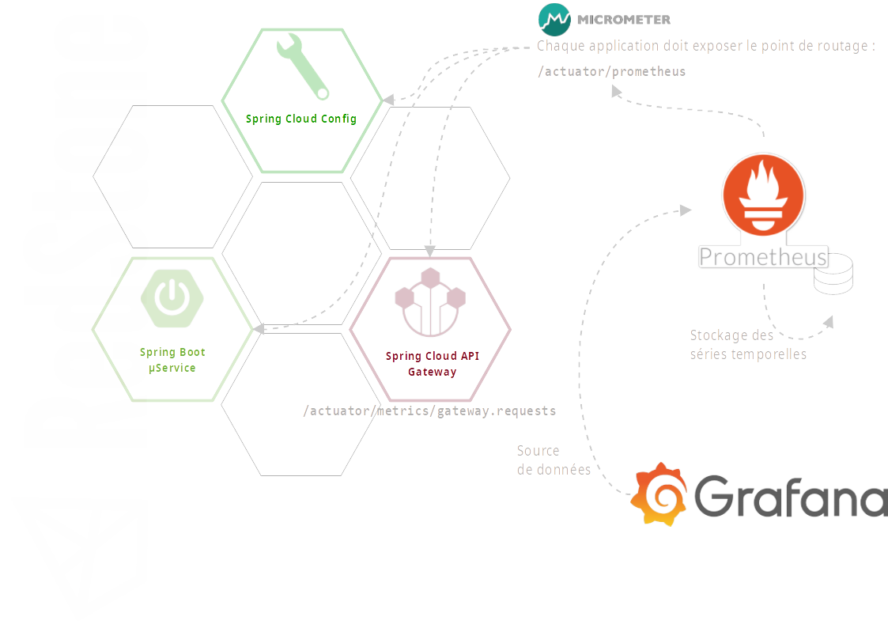

# Supervision des applications

- [Supervision des applications](#supervision-des-applications)
  - [1 Contexte Spring](#1-contexte-spring)
  - [2 Architecture cible](#2-architecture-cible)
    - [2.1 Fonctionnement](#21-fonctionnement)
    - [2.2 le trio gagnant](#22-le-trio-gagnant)
      - [2.2.1 Micrometer](#221-micrometer)
      - [2.2.2 Prometheus](#222-prometheus)
      - [2.2.3 Grafana](#223-grafana)
    - [**En conclusion**](#en-conclusion)

## 1 Contexte Spring

Historiquement, les applications Spring Boot peuvent être supervisées au travers de l'outil [Spring Boot Actuator](https://docs.spring.io/spring-boot/docs/current/reference/html/production-ready-features.html) via JMX ou des _endpoints_ HTTP.

Spring Boot Actuator met à disposition, au niveau de chaque application, un certain nombre de _endpoints_ standards préfixés par défaut par `/actuator` qu'il est possible d'enrichir.

La société [Codedentric](https://www.codecentric.de/) propose une solution de centralisation du monitoring des applications Spring avec [Spring Boot Admin](https://github.com/codecentric/spring-boot-admin) (Server & Client).

___


Le - mal nommé (!) - projet _Spring Boot Admin_ est un projet communautaire qui n'est pas soutenu par VMware Tanzu (ex Pivotal) et ne fait donc pas officiellement partie de l'écosystème Spring.
___

La publication de la version 2 de Spring Boot a introduit (en ce qui concerne le monitoring) :
- un _refactoring_ du projet Spring Boot Actuator pour
- le support de [micrometer](https://micrometer.io/) (cf. [Micrometer: Spring Boot 2's new application metrics collector](https://spring.io/blog/2018/03/16/micrometer-spring-boot-2-s-new-application-metrics-collector)).

_intégration de micrometer dans les dépendances Actuator par défaut dans Spring Boot 2_ :

```
[INFO] +- org.springframework.boot:spring-boot-starter-actuator:jar:2.3.3.RELEASE:compile
[INFO] |  +- (...)
[INFO] |  \- io.micrometer:micrometer-core:jar:1.5.4:compile
[INFO] |     +- (...)
```

De facto, de nombreux sous-projets Spring, dont Spring Cloud Gateway, intègrent des métriques au format micrometer.


Micrometer est spécialisé dans la collecte des métriques des applications tournant sur une JVM pouvant alimenter différents systèmes de supervision :

- Azure Monitor (cloud Microsoft),
- CloudWatch (AWS),
- Prometheus,
- ...
  
Il apporte la notion de dimension dans les métriques, en particulier la dimension de temps .

## 2 Architecture cible



### 2.1 Fonctionnement

Chaque application quelle qu'elle soit expose le _endpoint_ `/actuator/prometheus`.

Les applications qui dispose d'une implémentation spécialisée de Micrometer exposent les _endpoints_ associés, par exemple, pour Spring Cloud Gateway : `/actuator/metrics/gateway.requests`

L'instance [Prometheus](https://prometheus.io/) est configurée pour récupérer les informations et les stocker.

Exemple (fichier `prometheus.yml`) :

```yaml
(...)
scrape_configs:
- job_name: spring-cloud-gateway
  metrics_path: /actuator/prometheus
  static_configs:
  - targets: ['spring.cloud.gateway.url:port']
(...)    
```

L'instance [Grafana](https://grafana.com/grafana/) utilise l'instance Prometheus comme source de données pour réaliser le monitoring de manière visuelle, gérer les alertes, etc.

### 2.2 le trio gagnant


Sur la base de la recherche des meilleurs candidats selon les critères :

- Collecte des données
- Stockage des données
- Edition et visualisation des tableaux de bord
- Extensibilité du produit
- Compatibilité Cloud

Le critère Open source vs Offre commerciale n'est pas prépondérant car tous les produits cités sont _full featured_ en version Open Source. 


#### 2.2.1 Micrometer

Micrometer est, depuis Spring Boot 2, l'outil de collecte de métriques dimensionnelles par défaut.

Il est donc plus prudent de se conformer aux évolutions du framework dans son ensemble.

#### 2.2.2 Prometheus

Prometheus permet de collecter des données depuis de nombreuses sources, cf. [Prometheus, exporters and integrations](https://prometheus.io/docs/instrumenting/exporters/). Si ces derniers ne suffisent pas, des [librairies](https://prometheus.io/docs/instrumenting/clientlibs/) sont fournies dans de nombreux langages pour instrumenter le code afin de fournir les métriques voulues.

Prometheus dispose de son propre format de stockage optimisé pour les séries de données temporelles.

Pour la constitution des graphiques et des tableaux de bord, Prometheus semble plus compliqué à prendre en main et n'offre pas autant de souplesse que Grafana.

#### 2.2.3 Grafana

Grafana ne stocke pas les séries de données.

L'outil peut être étendu par l'utilisation de [plugins](https://grafana.com/grafana/plugins) et dispose d'un [catalogue de tableaux de bord](https://grafana.com/grafana/dashboards) prêts à l'emploi.
Il est par ce biais le plus complet en terme de visualisation des informations collectées.

Grafana offre par ailleurs la possibilité d'effectuer une visualisation en cycle de différents tableaux de bord.

Pour les solutions cloud, le choix entre Prometheus et Grafana repose principalement sur :

- la nécessité de faire la collecte des informations, et
- la facilité d'édition des tableaux de bord.

Dans la mesure où la collecte est souvent fournie _out of the box_ dans les offres cloud, Grafana semble être la meilleure solution.

_exemple de tableau de bord Grafana :_


### **En conclusion**

le choix de :

- Micrometer est fait en cohérence avec l'évolution de la _stack_ Spring Boot / Spring Cloud, 
- Prometheus pour ses capacités de collecte et de stockage des informations, et
- Grafana pour sa souplesse dans la constitution des tableaux de bord.

Ce choix permet également de :

- Rationaliser les outils de supervision entre les DEV et les OPS.
- Remettre éventuellement en cause l'utilisation de Spring Boot Admin.
