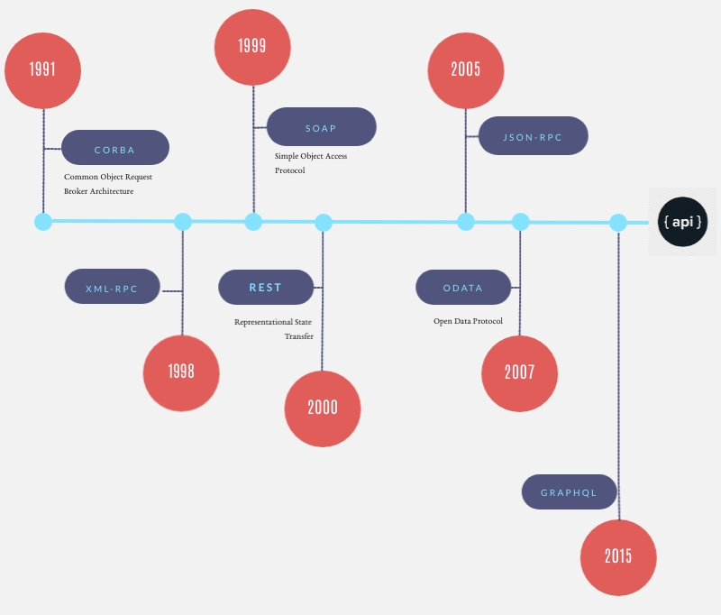

# Fondamentaux REST

Les API REST - Representational State Transfert - sont de plus en plus populaires :


REST est exposé par Roy Thomas Fielding dans sa thèse de Doctorat de philosophie en information et informatique intitulé « [Architectural styles and the design of network-based software architectures](./resources/documents/fielding_dissertation.pdf) » publiée en 2000. 

Il a participé dès 1994 à la spécification du World Wide Web par sa participation aux groupes de travail sur URI, HTML et HTTP au sein de l’IETF (Internet Engineering Task Force). Il est également un des co-fondateurs du projet de serveur HTTP  Apache et est membre de l’Apache Software Foundation.

REST est une abstraction des éléments architecturaux d’un système réparti d’hypermédias. Ce modèle d’architecture s’appuie sur la description première de l’architecture du World Wide Web :
* modèle architectural client / serveur ;
* communication sans état ;
* possibilité de mettre en cache les réponses à des requêtes ;
  
Et y ajoute de nouvelles contraintes :
* une **interface uniforme** entre les différents composants de l’architecture caractérisée par :
   * l’**identification des ressources** ;
   * la **manipulation des ressources par des représentations** ;
   * des **messages auto descriptifs** ;
   * l’**hypermédia comme "moteur"** de l’application.
* un système en couches : **chaque composant ne peut « voir » au-delà de la couche immédiate avec laquelle il interagit** ;
* un modèle de code à la demande (facultatif) permettant l’extension des fonctionnalités d’un client par le biais de téléchargement et d’exécution de code sous forme d’applet ou de scripts.

**REST n’est pas un standard, il n’existe donc pas de spécification** (cf. [REST - Semantic Web Standards](https://www.w3.org/2001/sw/wiki/REST) _a discussion draft, with no formal status at W3C_). Il faut comprendre ce style d’architecture, puis concevoir des services web (ou des applications web) selon ce style.





Parmi les géants du Web, ce sont eBay, suivi par Amazon qui ont publié les premiers des APIs selon ce modèle (REST), puis Flickr...

## 1. Les principes généraux

Bien que REST ne soit pas un standard, il utilise des standards, en particulier :
* [URI](https://tools.ietf.org/html/rfc3986) comme syntaxe universelle pour adresser les **ressources** ;
* HTTP ([RFC7230](https://tools.ietf.org/html/rfc7230), [RFC7231](https://tools.ietf.org/html/rfc7231), [RFC7232](https://tools.ietf.org/html/rfc7232), [RFC7233](https://tools.ietf.org/html/rfc7233), [RFC7234](https://tools.ietf.org/html/rfc7234), [RFC7235](https://tools.ietf.org/html/rfc7235), [RFC7236](https://tools.ietf.org/html/rfc7236), [RFC7237](https://tools.ietf.org/html/rfc7237)) ;
* Les liens hypermédia ;
* les [types MIMES](https://www.iana.org/assignments/media-types/media-types.xhtml) ;
* ...

### 1.1 L'identification des ressources

L'identification des ressources est une question centrale dans la conception des API REST. Elle doit donc être clairement définie et partagée par tous. 
Ce sont ses règle d'identification qui vont garantir notamment le cohérence et l'homogénéité des APIs. Cet aspect est d'autant plus important lorsque lesdites APIs deviennent publiques.

#### 1.1.1 Noms de domaines des API

La publication de sous-domaines pour les APIs est surtout à prendre en compte lorsque celles-ci sont **publiques**. Par anticipation, il est possible de mettre en place les domaines suivants : 
* **production** : https://**api**.example.com
* **tests** : https://**api.sandbox**.example.com
  
  Pour ces deux premiers sous-domaines, il est possible, lorsque les domaines métiers sont multiples et avec des APIs nombreuses, de les distinguer par domaines métiers, mais jamais par domaines techniques !

* **portail développeurs** : https://**developers**.example.com

#### 1.1.2 Versionning

La définition de l'architecture REST ne comporte aucun élément quant au versioning des APIs. Le versioning reste cependant un thème à part entière, notamment pour gérer l'évolutivité des services et donc des APIs proposées.

Il existe plusieurs solutions, communément admises :
* **Positionner le numéro de version de l'API, sur un digit (version majeure), au plus haut niveau du chemin de l'URI ;**
* Utiliser les en-têtes HTTP :
   * [_Accept_](https://www.w3.org/Protocols/rfc2616/rfc2616-sec14.html) : en utilisant la paramètre _level_
     Exemple :
     ```
     Accept: application/json;level=1
     ``` 
   * Utiliser un en-tête personnalisé, _Accept-version_.
     Exemple :
     ```
     Accept-version: v1
     ```
Pour sa simplicité de mise en oeuvre, c'est la **première solution** qui est très majoritairement utilisée. La numérotation retient **uniquement le numéro de version majeure**. Il faut donc définir les opérations qui sont à l'origine de ce changement de version, le plus souvent, il s'agit de **_breaking changes_**, notamment tout changement qui impacte directement les clients existants.

#### 1.1.3 Casse

Il existe 3 types principaux de style de casse : 
- **C**amel**C**ase, décliné en **l**ower**C**amel**C**ase et **U**pper**C**amel**C**ase,
- snake_case (utilisation du **_underscore_** pour séparer les termes), et
- spinal-case (utilisation du **tiret** - _hyphen_ - pour séparer les termes).

##### 1.1.3.1 URI

La [RFC 3986](https://www.ietf.org/rfc/rfc3986.txt) définie **les URIs sensibles à la casse**, sauf pour le protocole (_scheme_) et l'hôte dans la partie domaine (_authority_).

**Il faut donc préférer l'écriture des URIs en minuscules.**

Pour séparer les termes d'une expression, il reste possible d'utiliser soit l'underscore (snake_case), soit le tiret (spinal-case).

Pour une simple question de facilité de lecture et de visibilité des caractères, **il est préférable d'utiliser** le tiret, donc **la notation spinal-case**.

##### 1.1.3.2 Corps des requêtes et des réponses

Sur la base des règles, imposées ou de fait, d'un grand nombre de langage de programmation, dont Java, JavaScript, etc., il est recommandé d'utilisé la notation lowerCamelCase.

#### 1.1.4 Noms vs. Verbes

Il s'agit ici d'identifier des ressources et non des actions sur lesdites ressources. Il convient donc d'utiliser des noms et non des verbes. Les actions effectuées sur ces mêmes ressources seront portées par la méthode HTTP utilisée par la requête, en particulier pour les opérations CRUD :

 Operation  | méthode HTTP   | Commentaire(s) 
----------- | -------------- | ----------------
 Création | POST | Pour créer une instance dans une collection si l'identifiant de l'instance est inconnu. L'identification (l'URI) de la ressource nouvellement créée figure dans l'attribut _Location:_ de la réponse HTTP
 Création | PUT | Uniquement lorsque l'identifiant de la nouvelle ressource est fourni par le client dans la requête HTTP
 Recherche | GET | Pour la recherche d'une collection ou d'une instance dans une collection
 Mise à jour | PUT | Pour une mise à jour complète
 Mise à jour | PATCH | pour une mise à jour partielle
 Suppression | DELETE | Pour une suppression
 

#### 1.1.5 Singulier vs. Pluriel

#### 1.1.6 Strucuture hiérarchique


Par ailleurs sa maturité et sa grande popularité ont fait émerger des 

### 1.2 Bonnes pratiques et des standards de fait.

Et comme d'habitude, _**keep it simple, stupid**_ :
* N'importe quel développeur devrait pouvoir utiliser une API sans être obligé de se référer à la documentation. Mais si l'API est bien documentée, c'est mieux !
* Une API doit être conçue pour les applications clientes, elle peut donc dénormaliser le modèle de données auquel elle se rapporte.
* Les opérations de manipulation des ressources sont uniques
* L'identification des ressources doit utiliser des termes concrets et partagés par tous les acteurs (cf. _ubiquitous language_ dans [Domain-Driven Design: Tackling Complexity in the Heart of Software, Eric Evans, 2003](https://www.amazon.com/gp/product/0321125215?ie=UTF8&tag=martinfowlerc-20&linkCode=as2&camp=1789&creative=9325&creativeASIN=0321125215))
* Développer d'abord les cas d'utilisations _passants_, mais sans oublier qu'il faudra adresser les cas d'utilisations _non passants_.

