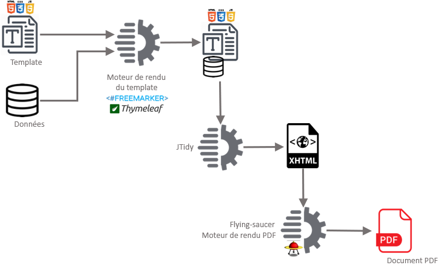

# POC Editique
## Génération de documents PDF à partir des moteurs de template FreeMarker et Thymeleaf

Le projet peut être construit avec :
- maven (cf. `pom.xml`, ou
- gradle (cf. `build.gradle`) **A COMPLETER**

Les noms de fichiers résultats sont figés :
- freemarkerPDFResult.pdf pour FreeMarker 2, et
- thymeleafPDFResult.pdf pour Thymeleaf
notamment pour l'exécution des benchmarks (environ 45000 fichiers générés).


#### Prérequis
- Java JRE 9+ (cf. Benchmarks)
- Maven 3.6.x
- Gradle 4+

#### Pipeline de rendu



Arborescence du projet :
```
├── README.md
├── build.gradle
├── freemarkerPDFResult.pdf
├── gradle
│   └── wrapper
│       ├── gradle-wrapper.jar
│       └── gradle-wrapper.properties
├── gradlew
├── gradlew.bat
├── pom.xml
├── src
│   ├── main
│   │   ├── java
│   │   │   └── nc
│   │   │       └── redstone
│   │   │           └── opt
│   │   │               ├── BarCodeService.java
│   │   │               ├── BarGraphService.java
│   │   │               ├── BaseBenchmark.java
│   │   │               ├── FreeMarkerBenchmark.java
│   │   │               └── ThymeleafBenchmark.java
│   │   └── resources
│   │       ├── static
│   │       │   ├── fonts
│   │       │   ├── images
│   │       │   └── styles
│   │       │       ├── graph.css
│   │       │       └── style.css
│   │       └── templates
│   │           ├── freemarker
│   │           │   ├── address.ftl
│   │           │   ├── footer.ftl
│   │           │   └── template.ftl
│   │           └── thymeleaf
│   │               ├── address.html
│   │               ├── footer.html
│   │               └── template.html
│   └── test
│       └── java
│           └── nc
│               └── redstone
│                   └── opt
│                       └── test
│                           ├── JUnit5Benchmark.java
│                           ├── JUnit5BenchmarkExtension.java
│                           └── TemplateEnginesTests.java
└── thymeleafPDFResult.pdf
```

Les templates sont spécialisés par moteur de rendu. Ils utilisent les mêmes feuilles de styles.

Les templates utilisent dans les deux cas les fragments.


#### Benchmarks

Le projet utilise :
- Java Microbenchmark Harness - JMH, et / ou
- Junit 5

##### JMH
- construire le projet :
    - Maven : `mvn clean install`
    - Gradle : **A COMPLETER**
- Lancer l'exécution des benchmarks : `java -jar target/benchmarks.jar`
  
  **ATTENTION** : l'exécution des benchmarks dure environ 25 minutes. Ne pas interrompre le process au risque de ne pas avoir de résultats !

##### JUnit 5
Il suffit de lancer l'exécution des tests :
- Maven : `mvn test`
- Gradle : **A COMPLETER**

Pour lancer des tests en masse, décommenter dans la classe de tests `TemplateEnginesTests` l'annotation `@RepeatedTest` en remplacement de l'annotation `@Test` (la supprimer dans ce cas).